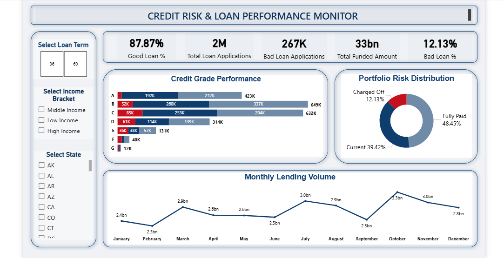

# 🏦 Bank Loan Risk Analysis

## 📌 Project Overview
This project analyzes a dataset of **2 million+ loan records** to assess credit risk, identify bad loan patterns, and visualize lending trends. The goal was to build a robust data pipeline using **Python, SQL, and Power BI** to help stakeholders minimize default rates.

## 🛠️ Tech Stack
* **Python:** Pandas (Data Cleaning, Regex extraction, Outlier removal).
* **MySQL:** Advanced Analysis (CTEs, Window Functions, Case Statements).
* **Power BI:** Interactive Dashboard (DAX Measures, Risk Visualization).

## 🔍 Key Insights
* **Risk vs. Income:** High-income borrowers have a significantly lower default rate than low-income borrowers.
* **Term Length:** 60-month loans are **riskier** than 36-month loans, showing a default rate of over 12%.
* **Risk Grades:** There is a clear correlation between lower credit grades (D-G) and higher "Charged Off" rates.

## 📊 Dashboard Snapshot

## 📂 Data Source
The raw dataset used for this analysis is available on Kaggle:
* [Lending Club Loan Data (Kaggle)](https://www.kaggle.com/datasets/wordsforthewise/lending-club)

**Note:** Due to GitHub's file size limits, the raw CSV file and the full Power BI (.pbix) file are not hosted in this repository. Please refer to the **Dashboard Snapshot** above to view the interactive results.
